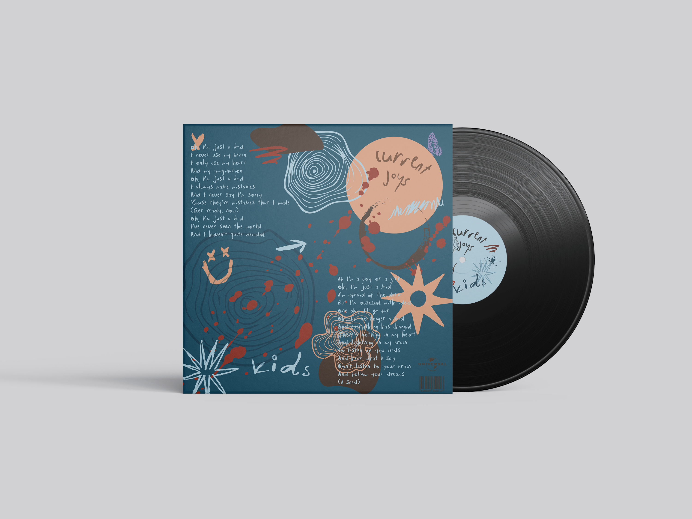

# 📋 ANÁLISIS COMPLETO: REQUISITOS DEL BRIEFING vs TU PROYECTO

**Fecha de análisis:** 2026-01-04
**Proyecto:** Portfolio Template - Ana Callejón
**Briefing:** WEB ATELIER (UDIT) - Final Course Project

---

## 🎯 NIVEL SELECCIONADO: First Grade (Vanilla HTML/CSS/JS)

Basándome en tu tech stack actual, estás trabajando en el nivel básico que requiere:

- ✅ HTML5 semántico
- ✅ CSS vanilla (sin frameworks)
- ✅ JavaScript vanilla (sin librerías externas)

---

## ✅ REQUISITOS CUMPLIDOS

### 1. Repository & Version Control

- ✅ GitHub repository existe: anacallejon/creative-portfolio-web
- ⚠️ .gitignore presente pero básico (solo .DS_Store)
- ❌ Falta git tag v1.0.0
- ❌ Falta GitHub Release

### 2. Deployment

- ✅ GitHub Pages configurado
- ✅ URL live funcional: https://anacallejon.github.io/creative-portfolio-web/
- ✅ Custom 404 page creada
- ✅ HTTPS enabled (automático con GitHub Pages)

### 3. Páginas Requeridas

- ✅ index.html (Home)
- ✅ projects.html (Portfolio/Projects)
- ✅ about.html (About/Experience)
- ✅ 404.html (Error page)
- ✅ Mínimo 3 páginas cumplido

### 4. Responsive Design

- ✅ Mobile-first approach implementado
- ✅ Fluid typography con clamp() en algunos elementos
- ✅ Tested en breakpoints: mobile (≤768px), desktop (>768px)
- ⚠️ Falta testing en tablet específico (481px-768px)
- ✅ Parallax effects implementados

### 5. HTML Semantics

- ✅ Elementos semánticos: `<header>`, `<nav>`, `<main>`, `<section>`, `<article>`, `<footer>`
- ✅ Heading hierarchy correcta (h1, h2, h3)
- ✅ Forms con labels asociados
- ✅ Estructura de directorios coherente

### 6. CSS Animations

- ✅ Múltiples animaciones CSS implementadas:
  - Carrusel infinito (scroll-left, scroll-right)
  - Fade-in effects
  - Blob morphing animation
  - Color change animation (404 page)
  - Float animations
  - Hero animations
- ✅ Keyframe animations implementadas
- ✅ Transitions suaves

### 7. JavaScript Functionality

- ✅ Custom cursor implementation
- ✅ Modal de proyectos
- ✅ Filtrado de proyectos
- ✅ Navbar hamburguesa responsive
- ✅ Scroll effects con Intersection Observer
- ✅ No hay errores en consola

---

## ❌ REQUISITOS FALTANTES CRÍTICOS

### 1. **DOCUMENTACIÓN OBLIGATORIA**

#### README.md ❌ INCOMPLETO

**Estado actual:** Muy básico (solo 4 líneas)

**Requiere:**

```markdown
# Portfolio Template - Ana Callejón

**🌐 LIVE SITE:** https://anacallejon.github.io/creative-portfolio-web/

## 📖 Project Description

[Descripción del proyecto]

## 🛠 Tech Stack

- HTML5
- CSS3 (Vanilla)
- JavaScript (Vanilla)
- GitHub Pages

## 📂 Project Structure

[Estructura de archivos]

## 🚀 Setup Instructions

[Instrucciones locales]

## 🎨 Customization Guide

[Cómo personalizar]

## 📸 Screenshots

[Capturas o GIF demo]

## 📄 License

This project is licensed under MIT License - see LICENSE file

## 👤 Author

Ana Callejón Alén

- Instagram: @calen.between
- LinkedIn: [perfil]
- Email: ana.callejonalen@gmail.com

## 🙏 Credits

- Fonts: Google Fonts (Unbounded, Petit Formal Script)
- Course: WEB ATELIER (UDIT)
- Professor: Rubén Vega Balbás, PhD
```

#### LICENSE ❌ FALTA COMPLETAMENTE

**Requerido:** Archivo LICENSE en la raíz del proyecto
**Recomendado:** MIT License

**Acción:**

1. Crear archivo `LICENSE` en la raíz
2. Copiar licencia MIT de https://choosealicense.com/licenses/mit/
3. Añadir tu nombre y año 2025

#### AI Usage Documentation ❌ FALTA

**Si usaste AI (Claude/ChatGPT/etc):**

1. Crear carpeta `docs/` en la raíz
2. Crear archivos `docs/plan1.md`, `docs/plan2.md`, etc.
3. Cada archivo debe contener:
   - Tu pregunta/prompt al AI
   - La respuesta completa del AI
   - Notas de implementación

**Estructura requerida:**

```
docs/
├── plan1.md  (ej: "Responsive Navigation Component")
├── plan2.md  (ej: "Project Modal Implementation")
├── plan3.md  (ej: "Scroll Animations")
└── ...
```

**Formato de cada plan.md:**

```markdown
# Feature: [Nombre de la funcionalidad]

## Prompt to AI

[Tu pregunta exacta]

## AI Response

[Respuesta completa del AI]

## Implementation Notes

- [x] Qué se implementó
- [ ] Qué se modificó del plan
- [ ] Decisiones tomadas
```

#### README: AI Agent Usage Policy ❌ FALTA

**Si usaste AI, añadir sección al README:**

```markdown
## 🤖 AI Agent Usage

This project was developed with the assistance of AI tools following a structured workflow:

### Two-Phase Workflow

1. **Planning Phase**: For each feature, I first requested a development plan
2. **Implementation Phase**: After documenting the plan, I proceeded with coding

### Features Developed with AI

- [x] Responsive navigation with hamburger menu (docs/plan1.md)
- [x] Project modal system (docs/plan2.md)
- [x] Scroll-based animations (docs/plan3.md)

All AI interactions are documented in the `docs/` folder with:

- Original prompts
- Complete AI responses
- Implementation notes
```

---

### 2. **METADATA & VISUAL IDENTITY** ⚠️ INCOMPLETO

#### `<head>` metadata ⚠️ PARCIAL

**Tienes:**

- ✅ `<meta charset="UTF-8">`
- ✅ `<meta name="viewport">`
- ✅ `<title>`

**FALTAN:**

```html
<!-- Description -->
<meta
  name="description"
  content="Ana Callejón - Creative Portfolio showcasing graphic design, multimedia and editorial projects"
/>

<!-- Keywords -->
<meta
  name="keywords"
  content="graphic design, portfolio, multimedia design, Ana Callejón"
/>

<!-- Author -->
<meta name="author" content="Ana Callejón Alén" />

<!-- Theme color -->
<meta name="theme-color" content="#8b93bc" />

<!-- Open Graph (Facebook/LinkedIn) -->
<meta property="og:title" content="Ana Callejón - Creative Portfolio" />
<meta
  property="og:description"
  content="Graphic and Multimedia Design student showcasing creative projects"
/>
<meta
  property="og:image"
  content="https://anacallejon.github.io/creative-portfolio-web/assets/img/og-image.png"
/>
<meta
  property="og:url"
  content="https://anacallejon.github.io/creative-portfolio-web/"
/>
<meta property="og:type" content="website" />

<!-- Twitter Card -->
<meta name="twitter:card" content="summary_large_image" />
<meta name="twitter:title" content="Ana Callejón - Creative Portfolio" />
<meta
  name="twitter:description"
  content="Graphic and Multimedia Design portfolio"
/>
<meta
  name="twitter:image"
  content="https://anacallejon.github.io/creative-portfolio-web/assets/img/twitter-card.png"
/>
```

#### Favicon ❌ FALTA

**Requerido:**

- favicon-16x16.png
- favicon-32x32.png
- apple-touch-icon-180x180.png

**Implementación:**

```html
<link
  rel="icon"
  type="image/png"
  sizes="16x16"
  href="assets/img/favicon-16x16.png"
/>
<link
  rel="icon"
  type="image/png"
  sizes="32x32"
  href="assets/img/favicon-32x32.png"
/>
<link
  rel="apple-touch-icon"
  sizes="180x180"
  href="assets/img/apple-touch-icon.png"
/>
```

#### manifest.json ⚠️ OPCIONAL PERO RECOMENDADO

**Para PWA-readiness:**

```json
{
  "name": "Ana Callejón Portfolio",
  "short_name": "Portfolio",
  "icons": [
    {
      "src": "assets/img/icon-192x192.png",
      "sizes": "192x192",
      "type": "image/png"
    },
    {
      "src": "assets/img/icon-512x512.png",
      "sizes": "512x512",
      "type": "image/png"
    }
  ],
  "theme_color": "#8b93bc",
  "background_color": "#ffffff",
  "display": "standalone"
}
```

---

### 3. **CODE QUALITY & STANDARDS** ⚠️ PARCIAL

#### Prettier ❌ NO CONFIGURADO

**Acción requerida:**

1. Crear `.prettierrc` en la raíz:

```json
{
  "semi": true,
  "singleQuote": false,
  "tabWidth": 2,
  "useTabs": false,
  "printWidth": 80
}
```

#### ESLint ❌ NO CONFIGURADO

**Acción requerida:**

1. Crear `.eslintrc.json` en la raíz:

```json
{
  "env": {
    "browser": true,
    "es2021": true
  },
  "extends": "eslint:recommended",
  "parserOptions": {
    "ecmaVersion": 12,
    "sourceType": "module"
  },
  "rules": {
    "no-console": "warn",
    "no-unused-vars": "warn"
  }
}
```

#### .gitignore ⚠️ INCOMPLETO

**Actual:** Solo .DS_Store

**Requiere:**

```
# macOS
.DS_Store
.AppleDouble
.LSOverride

# Windows
Thumbs.db
ehthumbs.db
Desktop.ini

# IDEs
.vscode/
.idea/
*.swp
*.swo
*~

# Dependencies (si usas npm en el futuro)
node_modules/

# Build outputs
dist/
build/

# Logs
*.log
npm-debug.log*
```

#### Comentarios en código ⚠️ MEJORABLE

**Estado actual:** Algunos comentarios presentes
**Mejorar:** Añadir más documentación en funciones complejas del JS

---

### 4. **ACCESSIBILITY (BÁSICA)** ⚠️ PARCIAL

#### Color contrast ❌ NO VERIFICADO

**Acción requerida:**

- Verificar contraste con herramienta: https://webaim.org/resources/contrastchecker/
- Asegurar WCAG AA (4.5:1 para texto)

**Combinaciones a verificar:**

- Texto #222 sobre fondo #e8eaf3
- Texto #fff sobre fondo #8b93bc
- Texto #cc1753 sobre fondo blanco

#### prefers-reduced-motion ❌ FALTA

**Acción crítica:** Añadir media query para usuarios con sensibilidad al movimiento

**Implementar en base.css:**

```css
@media (prefers-reduced-motion: reduce) {
  *,
  *::before,
  *::after {
    animation-duration: 0.01ms !important;
    animation-iteration-count: 1 !important;
    transition-duration: 0.01ms !important;
    scroll-behavior: auto !important;
  }

  .carousel-track {
    animation: none !important;
  }
}
```

#### Alt text ⚠️ MEJORABLE

**Estado actual:** Algunos alt vacíos (`alt=""`)
**Mejorar:** Todas las imágenes significativas necesitan alt descriptivo

**Ejemplo:**

```html
<!-- MAL -->


<!-- BIEN -->

```

#### Skip-to-content link ❌ FALTA (OPCIONAL)

**Recomendado para screen readers:**

```html
<body>
  <a href="#main-content" class="skip-link">Skip to main content</a>
  <nav>...</nav>
  <main id="main-content">...</main>
</body>
```

```css
.skip-link {
  position: absolute;
  top: -40px;
  left: 0;
  background: #000;
  color: #fff;
  padding: 8px;
  text-decoration: none;
  z-index: 100;
}

.skip-link:focus {
  top: 0;
}
```

---

### 5. **ESTRUCTURA DE ARCHIVOS** ⚠️ MEJORABLE

#### Actual:

```
portfolio/
├── index.html
├── about.html
├── projects.html
├── 404.html
├── README.md
├── .gitignore
└── assets/
    ├── css/
    ├── js/
    └── img/
```

#### Requiere según briefing:

```
portfolio-template/
├── index.html
├── 404.html
├── README.md
├── LICENSE                    ← FALTA
├── .gitignore                 ← EXPANDIR
├── .prettierrc                ← FALTA
├── .eslintrc.json             ← FALTA
├── manifest.json              ← OPCIONAL
├── docs/                      ← FALTA (si usas AI)
│   ├── plan1.md
│   ├── plan2.md
│   └── plan3.md
└── assets/
    ├── css/
    │   ├── index.css          ✅
    │   ├── base.css           ✅
    │   ├── layout.css         ✅
    │   ├── components.css     ✅
    │   └── reset.css          ✅
    ├── js/
    │   └── main.js            ✅
    └── img/                   ✅
        ├── favicon-16x16.png    ← FALTA
        ├── favicon-32x32.png    ← FALTA
        ├── apple-touch-icon.png ← FALTA
        ├── og-image.png         ← FALTA
        └── [tus imágenes]       ✅
```

---

### 6. **GIT & VERSION CONTROL** ⚠️ INCOMPLETO

#### Commits ⚠️ MEJORAR

**Recomendación:** Seguir Conventional Commits

```
feat: add custom 404 page with animated blob
fix: correct navbar logo visibility on scroll
style: improve mobile responsive layout
docs: update README with setup instructions
```

#### Git Tag ❌ FALTA

**Acción crítica antes de entregar:**

```bash
git tag -a v1.0.0 -m "Release v1.0.0 - Final submission"
git push origin v1.0.0
```

#### GitHub Release ❌ FALTA

**Acción crítica:**

1. Ir a GitHub → Releases → Create new release
2. Seleccionar tag v1.0.0
3. Título: "Portfolio Template v1.0.0"
4. Descripción:

```markdown
# Portfolio Template - Final Submission

## Features

- Responsive design (mobile-first)
- Custom cursor interaction
- Project filtering system
- Animated carousel
- Modal project viewer
- Custom 404 page

## Pages

- Home (index.html)
- Projects (projects.html)
- About (about.html)
- 404 Error Page

## Tech Stack

- HTML5 (Semantic)
- CSS3 (Vanilla, with animations)
- JavaScript (Vanilla, ES6+)

Live site: https://anacallejon.github.io/creative-portfolio-web/
```

---

## 📊 PUNTUACIÓN ESTIMADA (GRADING RUBRIC)

Basándome en la rúbrica del briefing:

### 1. Page Content & Structure (25 puntos)

**Actual:** ~22/25

- ✅ 3+ páginas HTML
- ✅ Contenido original y personalizado
- ✅ Navegación funcional
- ⚠️ Falta mejorar alt text en imágenes

### 2. Deployment & Repository Setup (10 puntos)

**Actual:** ~6/10

- ✅ GitHub Pages deployment
- ✅ Repositorio público
- ❌ Falta tag v1.0.0
- ❌ Falta GitHub Release
- ⚠️ .gitignore básico

### 3. Responsive Design Implementation (15 puntos)

**Actual:** ~13/15

- ✅ Mobile-first approach
- ✅ Fluid typography (parcial)
- ✅ Breakpoints implementados
- ⚠️ Falta testing exhaustivo en todos los tamaños

### 4. CSS Animations (15 puntos)

**Actual:** ~14/15

- ✅ Múltiples animaciones CSS
- ✅ Keyframes implementados
- ✅ Smooth transitions
- ✅ Creativity en efectos

### 5. HTML Semantics & Accessibility (10 puntos)

**Actual:** ~7/10

- ✅ Elementos semánticos
- ✅ Heading hierarchy
- ❌ Falta prefers-reduced-motion
- ⚠️ Alt text mejorable
- ❌ Contraste no verificado

### 6. Code Quality (10 puntos)

**Actual:** ~6/10

- ✅ Código limpio y organizado
- ❌ Sin Prettier configurado
- ❌ Sin ESLint configurado
- ⚠️ Comentarios mejorables

### 7. Documentation (10 puntos)

**Actual:** ~2/10

- ⚠️ README muy básico
- ❌ Falta LICENSE
- ❌ Falta AI documentation (si aplica)
- ❌ Falta setup instructions

### 8. Creative Execution (5 puntos)

**Actual:** ~5/5

- ✅ Diseño original y cohesivo
- ✅ Paleta de colores consistente
- ✅ Buena UX

---

## **TOTAL ESTIMADO: ~75/100**

**Para alcanzar 90+/100 necesitas:**

1. ✅ Completar toda la documentación (README, LICENSE, docs/)
2. ✅ Añadir metadata completa al `<head>`
3. ✅ Configurar Prettier y ESLint
4. ✅ Implementar prefers-reduced-motion
5. ✅ Crear tag v1.0.0 y GitHub Release
6. ✅ Generar favicons
7. ✅ Mejorar alt text en imágenes
8. ✅ Verificar contraste de colores

---

## 🚀 PLAN DE ACCIÓN INMEDIATO

### **PRIORIDAD CRÍTICA** (obligatorio antes de entregar):

1. **README.md completo** (30 min)
2. **LICENSE file** (5 min)
3. **Git tag v1.0.0** (2 min)
4. **GitHub Release** (10 min)
5. **Metadata en `<head>` todas las páginas** (20 min)
6. **prefers-reduced-motion** (10 min)
7. **.gitignore expandido** (5 min)

**Total tiempo crítico: ~1.5 horas**

### **PRIORIDAD ALTA** (muy recomendado):

8. **Favicons** (15 min + creación de iconos)
9. **AI documentation** si usaste AI (30 min)
10. **Prettier config** (5 min)
11. **ESLint config** (5 min)
12. **Mejorar alt text** (15 min)
13. **Verificar contraste** (15 min)

**Total tiempo alto: ~1.5 horas**

### **PRIORIDAD MEDIA** (nice to have):

14. **manifest.json** (10 min)
15. **Skip-to-content link** (10 min)
16. **Más comentarios en código** (20 min)
17. **Screenshots para README** (15 min)

---

## 📝 NOTAS FINALES

### Puntos Fuertes de tu Proyecto:

- ✅ Excelente diseño visual cohesivo
- ✅ Animaciones creativas y bien implementadas
- ✅ Código JavaScript limpio y funcional
- ✅ Responsive design bien ejecutado
- ✅ Custom cursor muy original
- ✅ Buena estructura de archivos CSS

### Áreas de Mejora Principal:

- ❌ Documentación insuficiente
- ❌ Falta configuración de herramientas (Prettier, ESLint)
- ❌ Accessibility parcialmente implementada
- ❌ Metadata incompleta
- ❌ Git workflow incomplete (sin tags ni releases)

---

## ✅ SIGUIENTE PASO

¿Quieres que te ayude a implementar estos cambios uno por uno?

Podemos empezar por lo más crítico (README, LICENSE, tags) y seguir con metadata y accessibility.

Dime cuál prefieres atacar primero y te genero los archivos completos listos para usar.
